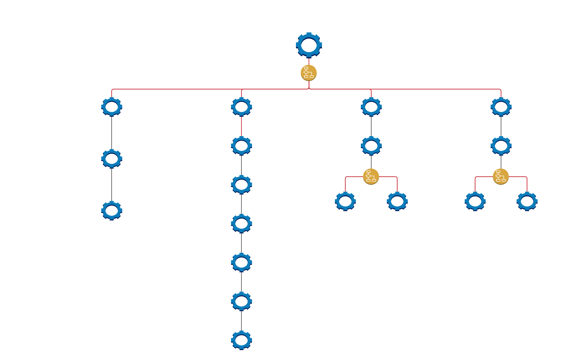

# Proyecto Devops - Daniel Sastre y Pere Antoni Borràs Expósito

---

 

## 1. Introduccion

 

Este proyecto consiste en la creación de un programa que sea capaz de obtener datos de una base de datos, además esta aplicación debe ser capaz de realizar CRUD (crear, leer, actualizar y eliminar documentos), con el objetivo de poder obtener archivos de la base de datos para que un generador de sitios estáticos, lo visualice en una página web y se actualice a tiempo real a medida que se van realizando consultas en la base de datos a través del programa.

 

---

 

## 2. Metodología

 

Hemos utilizado una metodología __incremental__, combinado con un marco de trabajo ágil, que es el __Scrum__ y utilizando __Gitflow__;

En primer lugar, al principio de la creación del proyecto se establecieron unas tareas, las cuales según las reglas del Scrum, se denomina __backlog__.

Esas tareas se distinguían según si eran más específicas o más generales y según su nivel de dificultad: en __Épicas__ o simplemente __Tareas__. Todas las tareas y épicas tienen un número de __tokens__, donde se estima el tiempo aproximado que se necesitará para realizarlas. Un token es equivalente a __15 minutos__. Además, en cada tarea se define cómo saber que una tarea o épica está completada.

A continuación, la diferencia entre __épicas__ y __tareas__:

- __Épicas__: Son tareas que se deben cumplir para poder conseguir implementar todos los objetivos necesarios, son __imprescindibles__. Estas tareas contienen tareas más pequeñas que siempre están relacionadas entre sí. Cada épica debe contener un número para indicar qué épica es, una descripción del objetivo que se quiere conseguir completando esa épica, un apartado "DONE", donde se debe indicar cómo saber que la épica ha sido completada y "TOKENS", que es la estimación aproximada del tiempo para completar la épica.

Su notación en Github sería la siguiente:

    Épica 1

        El usuario requiere acceder a una base de datos para obtener información y mostrarla en el generador de sitios estáticos.

            DONE ==> Cuando se pueda acceder a la base de datos y haya un esquema estricto definido.
            TOKENS ==> 22

- __Tareas__: Son tareas específicas de la épica a la que se referencia, todas deben estar estrictamente relacionadas con el objetivo de la épica en cuestión. Al igual que las épicas, debe contener un número para referenciar a la épica, una descripción de la tarea, un apartado "DONE" y otro apartado "TOKENS".

Su notación en Github es la siguiente:

    Tarea 1.1

        Disponer de un usuario en MongoAtlas

            DONE ==> La cuenta debe existir y ser accesible.
            TOKENS ==> 2

 
 

En relación con la metodología, hemos utilizado la __incremental__, ya que cada tarea constituye a un incremento, que añade una nueva funcionalidad al programa. 

La analogía sería la siguiente:

 

 

Cada iteración se constituye de 5 fases:

- __Tarea del Backlog__: se refiere a la tarea que se encuentra en el Backlog, es el objetivo que se debe cumplir.
- __Creación de código nuevo__: se crea código nuevo en base a la tarea que se ha elegido.
- __Casos test sobre el código nuevo__: se crean casos test para el código que se ha creado, asegurándose que funciona de manera correcta y según lo esperado.
- __Implementación del código__: se realiza la integración del código nuevo al código principal.
- __Subirlo a Github__: una vez realizados los pasos anteriores, se suben los nuevos cambios a Github.

 

Hay que tener en cuenta que algunas tareas no son de programación de código, aún así se revisan que sean cumplidas y funcionales.

 

En la parte de "Subirlo a Github", se refiere a subirlo al repositorio que hemos creado, donde se ha aplicado el siguiente __gitflow__.

 

- __Main__: Es la rama principal y donde se sitúa todo el código y contenido funcional.
- __Developing__: Es la rama de desarrollo.
- __Developing_Dani__: Es la rama de desarrollo personal uno de los colaboradores.
- __Developing_Pere__: Es la rama de desarrollo personal uno de los colaboradores.

La forma en la que se ha utilizado Github consiste en que cada uno de los colaboradores trabaja en una tarea del Backlog, de esa forma se realiza un trabajo en paralelo que no interfiere entre ninguno de los colaboradores, una vez que un colaborador termina la tarea del Backlog, se aplica un "merge" de la rama en la que esté trabajando a "Developing".

 

---

 

## 4. Diseño

 
 

El diseño conceptual del programa sería el siguiente:

 

En este pequeño esquema del proyecto, se quiere indicar como es el funcionamiento del mismo. 

 

Los componentes más importantes son la __base de datos__ (el cilindro de color verde), el __programa__ (la tuerca de color azul) y el __generador de sitios estáticos__ (la estación de color naranja).

En este esquema, el programa consulta a la base de datos según unos parámetros, la base de datos le devuelve una respuesta que serían los contenidos que se están buscando según esos parámetros. Seguidamente, el programa lleva los datos al generador de sitios estáticos para que el usuario pueda visualizarlos.

 

El programa se encarga principalmente de consultar datos y mostrárselos al usuario, pero también es capaz de realizar CRUD, es decir, la capacidad de crear, actualizar y eliminar documentos de la base de datos a parte de poder leerlos. Para ello, procederemos a explicar la estructura del programa de una forma más detallada:

 

En el esquema aparecen unos pequeños símbolos circulares amarillos, que representan una respuesta de consola que debe realizar el usuario del programa para que el programa sepa qué función debe utilizar. Todas las líneas rojas indican que ese __módulo__ depende de una respuesta del usuario.

En el esquema también se puede observar que existen cuatro módulos principales, los cuales se encargan cada uno de acometer las funciones CRUD, de forma respectiva.

