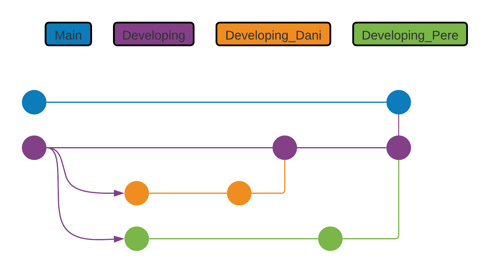
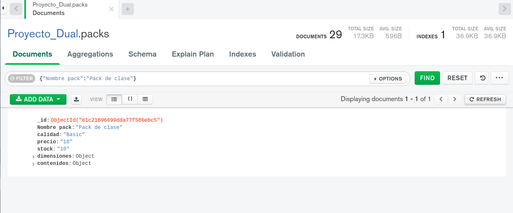

# Proyecto Devops

---

 

## __Índice__

 

    1. Introducción

    2. Metodología

    3. Análisis
        3.1 Partes interesadas
        3.2 Tecnologías usadas

    4. Diseño

    5. Implementación
        5.1 Herramientas utilizadas
        5.2 Frontend
            5.2.1 Funcionamiento de Hugo
        5.3 Backend

    6. Pruebas

    7. Dificultades

    8. Comparación temporal

 

---

 

## 1. __Introduccion__

 

Este proyecto consiste en la creación de un programa que sea capaz de obtener datos de una base de datos, además esta aplicación debe ser capaz de realizar CRUD (crear, leer, actualizar y eliminar documentos), con el objetivo de poder obtener archivos de la base de datos para que un generador de sitios estáticos, lo visualice en una página web y se actualice a tiempo real a medida que se van realizando consultas en la base de datos a través del programa.

 

---

 

## 2. __Metodología__

 

Hemos utilizado una metodología __incremental__, combinado con un marco de trabajo ágil, que es el __Scrum__ y utilizando __Gitflow__;

En primer lugar, al principio de la creación del proyecto se establecieron unas tareas, las cuales según las reglas del Scrum, se denomina __backlog__.

Esas tareas se distinguían según si eran más específicas o más generales y según su nivel de dificultad: en __Épicas__ o simplemente __Tareas__. Todas las tareas y épicas tienen un número de __tokens__, donde se estima el tiempo aproximado que se necesitará para realizarlas. Un token es equivalente a __15 minutos__. Además, en cada tarea se define cómo saber que una tarea o épica está completada.

A continuación, la diferencia entre __épicas__ y __tareas__:

- __Épicas__: Son tareas que se deben cumplir para poder conseguir implementar todos los objetivos necesarios, son __imprescindibles__. Estas tareas contienen tareas más pequeñas que siempre están relacionadas entre sí. Cada épica debe contener un número para indicar qué épica es, una descripción del objetivo que se quiere conseguir completando esa épica, un apartado "DONE", donde se debe indicar cómo saber que la épica ha sido completada y "TOKENS", que es la estimación aproximada del tiempo para completar la épica.

Su notación en Github sería la siguiente:

    Épica 1

        El usuario requiere acceder a una base de datos para obtener información y mostrarla en el generador de sitios estáticos.

            DONE ==> Cuando se pueda acceder a la base de datos y haya un esquema estricto definido.
            TOKENS ==> 22

- __Tareas__: Son tareas específicas de la épica a la que se referencia, todas deben estar estrictamente relacionadas con el objetivo de la épica en cuestión. Al igual que las épicas, debe contener un número para referenciar a la épica, una descripción de la tarea, un apartado "DONE" y otro apartado "TOKENS".

Su notación en Github es la siguiente:

    Tarea 1.1

        Disponer de un usuario en MongoAtlas

            DONE ==> La cuenta debe existir y ser accesible.
            TOKENS ==> 2

 
 

En relación con la metodología, hemos utilizado la __incremental__, ya que cada tarea constituye a un incremento, que añade una nueva funcionalidad al programa. 

La analogía sería la siguiente:

 

 

Cada iteración se constituye de 5 fases:

- __Tarea del Backlog__: se refiere a la tarea que se encuentra en el Backlog, es el objetivo que se debe cumplir.
- __Creación de código nuevo__: se crea código nuevo en base a la tarea que se ha elegido.
- __Casos test sobre el código nuevo__: se crean casos test para el código que se ha creado, asegurándose que funciona de manera correcta y según lo esperado.
- __Implementación del código__: se realiza la integración del código nuevo al código principal.
- __Subirlo a Github__: una vez realizados los pasos anteriores, se suben los nuevos cambios a Github.

 

Hay que tener en cuenta que algunas tareas no son de programación de código, aún así se revisan que sean cumplidas y funcionales.

 

En la parte de "Subirlo a Github", se refiere a subirlo al repositorio que hemos creado, donde se ha aplicado el siguiente __gitflow__.

 

- __Main__: Es la rama principal y donde se sitúa todo el código y contenido funcional.
- __Developing__: Es la rama de desarrollo.
- __Developing_Dani__: Es la rama de desarrollo personal uno de los colaboradores.
- __Developing_Pere__: Es la rama de desarrollo personal uno de los colaboradores.

La forma en la que se ha utilizado Github consiste en que cada uno de los colaboradores trabaja en una tarea del Backlog, de esa forma se realiza un trabajo en paralelo que no interfiere entre ninguno de los colaboradores, una vez que un colaborador termina la tarea del Backlog, se aplica un "merge" de la rama en la que esté trabajando a "Developing".

 

---

 

## 3. __Análisis__

 

#### 3.1 __Partes interesadas__

 

Se identifican como partes interesadas:

- La empresa que tiene la necesidad de implementar el software.
- El usuario con la necesidad del uso del software.

 

#### 3.2 __Tecnologías usadas__

 

| ----- | Tecnologías | ----- |
| -- | -- | -- |
| Hugo | MongoDB | Python |

 

---

 

## 4. __Diseño__

 
 

El diseño conceptual del programa sería el siguiente:

 

En este pequeño esquema del proyecto, se quiere indicar como es el funcionamiento del mismo. 

 

Los componentes más importantes son la __base de datos__ (el cilindro de color verde), el __programa__ (la tuerca de color azul) y el __generador de sitios estáticos__ (la estación de color naranja).

En este esquema, el programa consulta a la base de datos según unos parámetros, la base de datos le devuelve una respuesta que serían los contenidos que se están buscando según esos parámetros. Seguidamente, el programa lleva los datos al generador de sitios estáticos para que el usuario pueda visualizarlos.

 

El programa se encarga principalmente de consultar datos y mostrárselos al usuario, pero también es capaz de realizar CRUD, es decir, la capacidad de crear, actualizar y eliminar documentos de la base de datos a parte de poder leerlos. Para ello, procederemos a explicar la estructura del programa de una forma más detallada:

 

En el esquema aparecen unos pequeños símbolos circulares amarillos, que representan una respuesta de consola que debe realizar el usuario del programa para que el programa sepa qué función debe utilizar. Todas las líneas rojas indican que ese __módulo__ depende de una respuesta del usuario.

En el esquema también se puede observar que existen cuatro módulos principales, los cuales se encargan cada uno de acometer las funciones CRUD, de forma respectiva.

 

## 5. __Implementación__

### 5.1 __Herramientas utilizadas__

 

| ----------------- Herramientas ----------------- |
| -- |

| VSCode |
Dnspython |
Pymongo |
Pytest |
Clockify |

 

Las herramientas que hemos utilizado han sido Visual Studio Code, las librerías de Python pymongo y dnspython, las cuales se utilizan para poder operar en mongodb desde Python, pytest, que se ha utilizado para realizar los casos test y Clockify, para controlar el tiempo usado.

 

### 5.2 __Frontend__

 

El __frontend__ es la parte del generador de sitios estáticos, Hugo.

El usuario visualizará el contenido que se encuentra en un directorio de Hugo, que el programa de Python sabe que se debe colocar ahí. Por lo tanto, la cantidad de páginas a mostrar variará según el contenido de ese directorio de Hugo.

 

#### 5.2.1 __Funcionamiento de Hugo__

Hugo es un generador de sitios estáticos que visualizará todo el contenido que se encuentre dentro del directorio "content".

La organización de los directorios es la siguiente:

Como se ha dicho antes, el contenido Markdown está dentro de "content" y el código HTML que se visualiza está localizado dentro de layouts.

Dentro de los archivos HTML se encuentran variables que Hugo usa, en este caso, para detectar cambios en la carpeta "content", para que de esta manera la página cambie en el momento en el que se añadan o borren contenidos dentro de ese directorio.

 

### 5.3 __Backend__

 

El __backend__ es toda la parte de programación en Python y la base de datos, Mongo Atlas:

La base de datos solo almacena y distrubuye la informacion, la cual guarda los documentos con un esquema específico, y por la otra parte, se encuentra Python, la cual aplica *CRUD*. 

Es decir, dependiendo de lo que se necesita:

- *C* (create): Insertará uno o varios archivos en la base de datos. 

- *R* (read): Buscará los archivos que se le pida según unos parámetros indicados por el usuario y se los pasará al generador de sitios estáticos (Hugo) convertidos en Markdown. 

- *U* (update): Actualizará un documento o el campo de un documento. 

- *D* (delete): Elimina uno o varios documentos.

Aún así, en la parte de insertar documentos, no se podrá insertar ningún documento que no cumpla el __esquema__ indicado en la base de datos, ya que es de tipo __estricto__:

 

 

---

 

## 6. __Pruebas__ 

 

En este apartado se comprobarán varias funcionalidades del programa, donde se realizarán varias pruebas para ver si el programa realiza todas las operaciones CRUD correspondientes.

 

- En primer lugar, abriremos el programa principal el cual nos pedirá mediante la escritura en la terminal.

 

 

- Crearemos un "pack" que se llame clase, el cual si es buscado en la base de datos, vemos que no existe desde un principio.

 

 
 

- Seguidamente introducimos "1" en la terminal y nos dedicamos a crear el "pack".

 

 
 

- Una vez terminado, podemos ver que el último mensaje es que se ha introducido el documento, por eso motivo comprobaremos manualmente que se encuentra dentro de la base de datos.

 

 
 

- Ahora se realizará una búsqueda de este documento con el programa y lo colocará de forma que Hugo lo pueda visualizar.

 

 
 

- Para mostrar la página de Hugo, se debe realizar el comando "hugo server -D" una vez nos encontremos en el directorio raíz de Hugo. (Es decir, en nuestro proyecto, dentro de la carpeta "hugo"), cuando el servidor esté activo, se navegará a la web a través de un buscador, accediendo al puerto 1313 (http://localhost:1313/).

 

 
 

- Ahora procedemos a actualizar un campo del documento "Pack de clase" y luego cambiaremos todos sus valores.
Aquí se actualizará el campo "Nombre pack" y el nuevo nombre será "Pack alumnado".

 

 
 

- Se comprueba que el pack que en el campo "Nombre pack" contenía "Pack de clase" ahora contiene "Pack alumnado"

 

 
 

- Ahora se actualizaran todos los campos del "pack" sobre el que se estaban realizando cambios.

 

 
 

- En la base de datos podemos ver que "Pack Alumnado" ya no existe y se han actualizado todos los valores de los campos.

 

 
 

 
 

- Por último, se eliminará un documento. 

 

 
 

 
 

---

 

## 7. __Dificultades__

 

Las dificultades que hemos tenido han sido varias. En el ámbito global hemos tenido dificultades con el tiempo,
porque nunca antes habíamos hecho un proyecto de tal magnitud y por lo tanto, mucha incertidumbre. Además, el hecho de trabajar
en un proyecto con un compañero, la organización y combinar nuestras ideas para llegar al mismo punto tambien se complicó al inicio.

Otras dificultades han sido aprender a utilizar pymongo, la configuración y el tiempo que conlleva realizar la parte de Hugo, implementar SOLID y en lo que hemos fallado además de que no entendíamos el porqué, era aplicar e implementar TDD, ahora nos hemos dado cuenta de lo útil que es, pero a pesar de que en su momento quisimos implementarlo, el tiempo no era el suficiente.

 

---

 

## 8. __Comparación temporal__

 

El tiempo estimado del proyecto era un total de __203 tokens__, que sería el equivalente a __50,75 horas__.

El tiempo inputado en la aplicación Clockify ha sido el siguiente:

 

 
 

Hemos excedido el tiempo límite casi por __40 horas__, debido a la incertidumbre y desconocimiento de cuánto tomarían las tareas.
Seguidamente, un diagrama de barras que cuenta de forma aproximada el tiempo tomado en cada tarea épica:

 
 

 

La barra gris es el tiempo estimado inicial, las barras de colores es el tiempo aproximado real que se ha estado con cada tarea épica.

 

---

Realizado por Daniel Sastre Hernández y Pere Antoni Borràs Expósito

---
